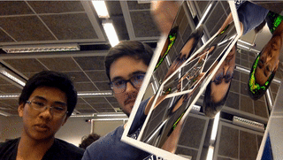

# Realidade Aumentada
- Eduardo Tirta
- Frederico Curti
- Hugo Mendes
___

## Introdução e Objetivo do Projeto
A realidade aumentada é um conceito de aplicação que aumenta a experiência do mundo virtual ao mundo real, sobrepondo elementos visuais computadorizados com imagens do mundo real. Esses 

O projeto tem o objetivo de simular uma realidade aumentada, a partir de uma camera e de marcadores visuais (Aruco), substituindo o conteúdo da folha com os marcadores por outro conteúdo arbitrário (eg. uma foto do Neymar)

## Executando
Para executar o projeto rode o seguinte comando, substituindo o `<image_file>` pelo nome da imagem que deseja projetar no marcador: 
```bash
pip3 install -r requirements.txt
python3 main.py <image_file>
```
Além disso, garanta que no mesmo diretório possua a imagem [`board_aruco_fix.png`](board_aruco_fix.png) e a imagem que deseja projetar, caso não deseje inserir uma imagem própria, o programa usará a imagem `neymar.jpg` . Essa imagem é usada para detectar os markers em uma imagem e relacioná-la com os markers em cada frame capturado pela webcam, criando a matriz de homografia para transformar uma imagem de entrada e deformar sua perspectiva para 'encaixá-la' sobre o tabuleiro na webcam.



- Caso queira o modo *INCEPTION* como o do GIF basta escrever `inception` no lugar de `<image_file>`
